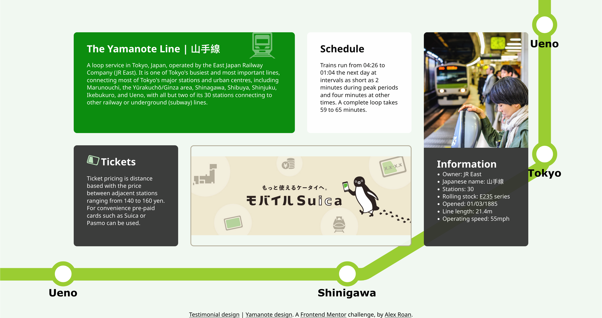
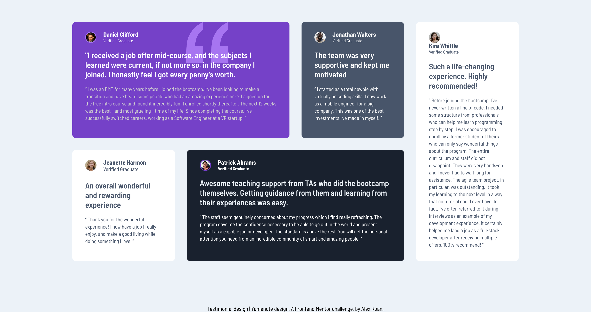

# Frontend Mentor - Testimonials grid section solution

This is a solution to the [Testimonials grid section challenge on Frontend Mentor](https://www.frontendmentor.io/challenges/testimonials-grid-section-Nnw6J7Un7). Frontend Mentor challenges help you improve your coding skills by building realistic projects. 

## Table of contents

- [Overview](#overview)
  - [The challenge](#the-challenge)
  - [Screenshot](#screenshot)
  - [Links](#links)
- [My process](#my-process)
  - [Built with](#built-with)
  - [What I learned](#what-i-learned)
  - [Continued development](#continued-development)
  - [Useful resources](#useful-resources)
- [Author](#author)
- [Acknowledgments](#acknowledgments)

**Note: Delete this note and update the table of contents based on what sections you keep.**

## Overview

### The challenge

I completed the standard design in on HTML document it's [testimonials.html](testimonial.html)
And a second 'Yamanote line' inspired alternative design [index.html](index.html)

### Screenshot

### Links

- Solution URL: [Github Repo](https://dearestalexander.github.io/fm-testimonials-grid/)
- Live Site URL: [Github Pages](https://github.com/dearestalexander/fm-testimonials-grid)

## My process

As we progress through the challenges I'm starting to follow a more natural workflow.

1. Set up my basic HTML and CSS docs (variables based on styles guide, reset, google fonts etc.)
2. Build out the basic semantic structure in HTML
3. Start building CSS
    - Start by building global styling, layout and styles that would be independent of content inside the blocks
    - Build the design for the testimonials page
    - Build the design for my alternate Yamanote page

### Built with

- Semantic HTML5 markup
- CSS custom properties
- Flexbox
- CSS Grid

### What I learned

Thankfully the linked training materials in the previous exercise on grid were quite good so I found it quite straightforward to create this layout.

I spent a little time creating a custom .svg background for my alternate design. I did this in figma. I had to do some reading up on how screen resolutions and sizes work for different devices. It turns out to be not that straightforward to estimate window sizes based on device sizes. But I found some useful online tools.

I also discovered you can't adjust opacity for background images. But there are a couple of alternate ways to get a desired effect.

### Continued development

I'm getting more comfortable with these kind of 'macro layouts', I'm interested in future to see how much we can use layouts inside elements.

In this exercise I did use 'grid' again inside the cards to align the 'headshot' profile images and text. I choose grid just to practice more and see if it had any unusual impacts on the outer grid. One learning I had was using grid just for small alignment like this is also very easy and simple.

### Useful resources

## Author

- Website - [Alexander Roan](https://www.alexroan.com)
- Frontend Mentor - [@dearestalexander](https://www.frontendmentor.io/profile/dearestalexander)
- Twitter - [@xander_roan](https://x.com/xander_roan)

**Note: Delete this note and add/remove/edit lines above based on what links you'd like to share.**

## Acknowledgments

Thanks to everyone !